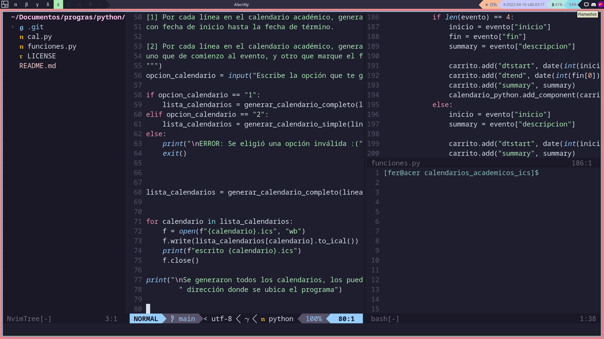
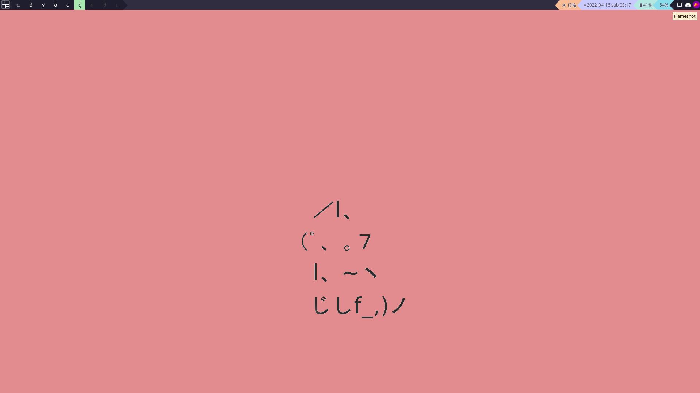
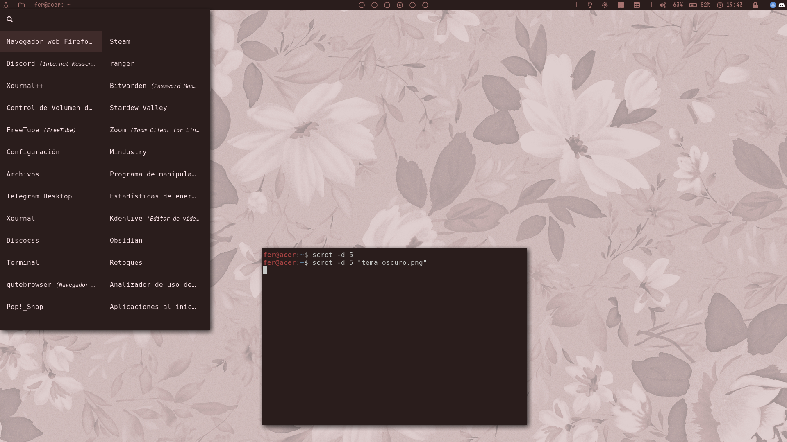
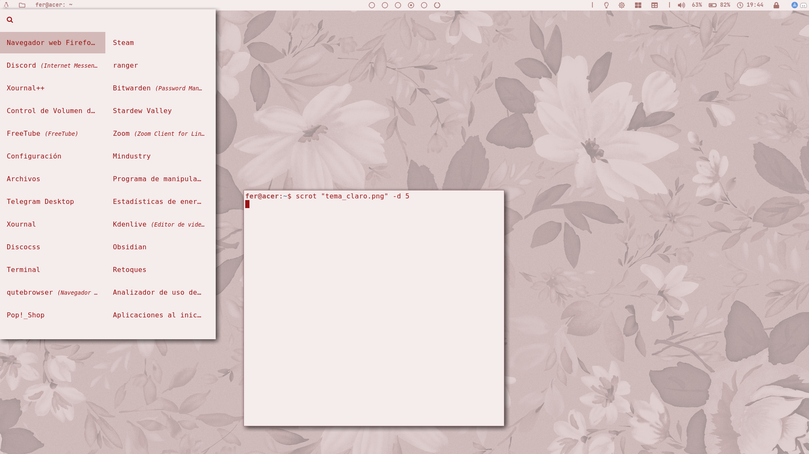

# dotfiles 

## QTILE

## BSPWM

Configuraciones personales, por lo que algunos archivos no estarán tan ordenados. De todas maneras, cualquier persona puede usar configuraciones de aquí. 

# Incluye aplicaciones como:

- Bspwm
- Polybar
- Rofi
- Nvim
- Ranger
- Kitty

# Dependencias

- Font Awesome v5
- sct
- Python 3
- i3-lock
